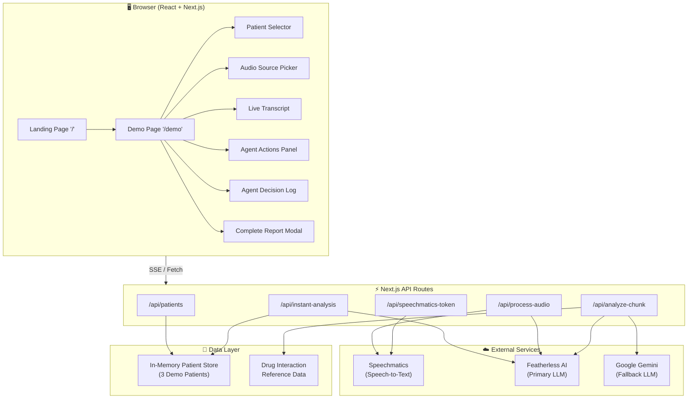
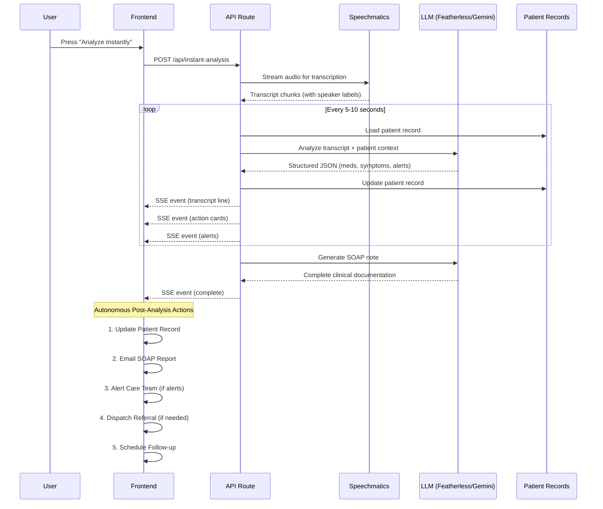
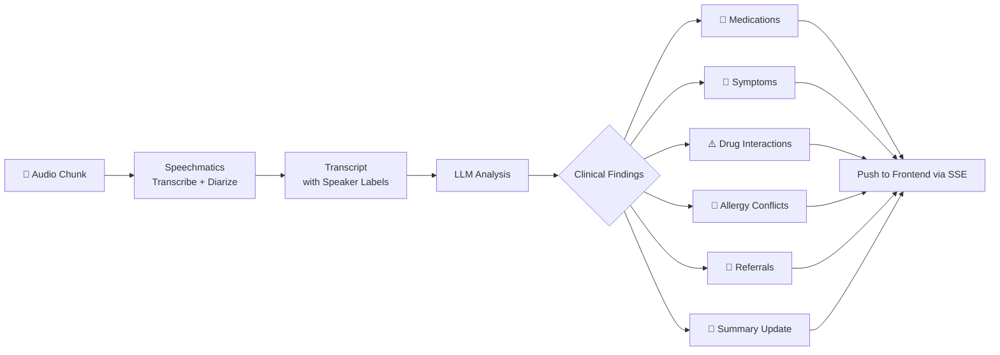

# Nura — Autonomous Clinical Voice Agent


**An autonomous AI agent that listens to doctor-patient conversations and independently detects drug interactions, flags allergy conflicts, routes referrals, and generates structured clinical documentation — all in real-time, without any commands from the physician.**

---

## Table of Contents

- [Nura — Autonomous Clinical Voice Agent](#nura--autonomous-clinical-voice-agent)
  - [Table of Contents](#table-of-contents)
  - [Features](#features)
  - [Tech Stack](#tech-stack)
  - [Architecture Overview](#architecture-overview)
    - [System Architecture](#system-architecture)
    - [Autonomous Agent Pipeline](#autonomous-agent-pipeline)
    - [Processing Pipeline (per audio segment)](#processing-pipeline-per-audio-segment)
  - [Prerequisites](#prerequisites)
  - [Installation](#installation)
  - [Configuration](#configuration)
  - [Usage](#usage)
    - [Instant Demo Mode](#instant-demo-mode)
    - [Live Microphone Mode](#live-microphone-mode)
  - [Available Scripts](#available-scripts)
  - [Project Structure](#project-structure)
  - [API Reference](#api-reference)
    - [`GET /api/patients`](#get-apipatients)
    - [`POST /api/instant-analysis`](#post-apiinstant-analysis)
    - [`POST /api/process-audio`](#post-apiprocess-audio)
    - [`POST /api/analyze-chunk`](#post-apianalyze-chunk)
    - [`GET /api/speechmatics-token`](#get-apispeechmatics-token)
  - [Demo Scenarios](#demo-scenarios)
  - [Deployment](#deployment)
    - [Vultr (Recommended for Hackathon)](#vultr-recommended-for-hackathon)
    - [Vercel](#vercel)
  - [Contributing](#contributing)
  - [License](#license)
  - [Tech Stack](#tech-stack-1)
  - [Environment Variables](#environment-variables)
  - [Architecture](#architecture)
  - [Project Structure](#project-structure-1)
  - [Deployment (Vultr)](#deployment-vultr)
  - [Built For](#built-for)

---

## Features

- **One-button operation** — press play and the agent handles everything autonomously
- **Real-time transcription** with speaker diarization (Doctor vs. Patient) via Speechmatics
- **Drug interaction detection** — cross-references mentioned medications against patient records
- **Allergy conflict alerts** — flags prescriptions that conflict with known allergies
- **Urgent finding escalation** — identifies critical symptoms and triggers specialist referrals
- **Autonomous post-analysis pipeline** — updates patient records, emails SOAP reports, alerts care teams, dispatches referrals, and schedules follow-ups without user input
- **SOAP note generation** — produces structured clinical documentation (Subjective, Objective, Assessment, Plan)
- **Live microphone mode** — real-time speech analysis via Web Speech API
- **Instant demo mode** — pre-recorded scenarios with staggered card animations for rapid demonstration
- **Dark-themed, responsive UI** — built with Tailwind CSS and custom animations

---

## Tech Stack

| Layer | Technology | Version | Purpose |
|-------|-----------|---------|---------|
| Framework | Next.js (App Router) | 14.2 | Full-stack: React frontend + API routes |
| Language | TypeScript | 5.5 | Type safety across the codebase |
| Speech-to-Text | Speechmatics Real-Time Client | 8.3.2 | Transcription with speaker diarization |
| Primary LLM | Featherless AI (google/gemma-4-31B-it) | — | Clinical reasoning, entity extraction, SOAP generation |
| Fallback LLM | Google Gemini (gemini-3.1-flash lite) | — | Secondary reasoning engine |
| LLM SDK | OpenAI Node SDK | 4.50 | OpenAI-compatible client for Featherless |
| AI SDK | @google/generative-ai | 0.21 | Gemini integration |
| Styling | Tailwind CSS | 3.4 | Dark theme, responsive UI, animations |
| Fonts | Source Sans 3 + Literata | — | Body + display typography |

---

## Architecture Overview

### System Architecture



### Autonomous Agent Pipeline



### Processing Pipeline (per audio segment)



---

## Prerequisites

- **Node.js** ≥ 20.x
- **npm** ≥ 10.x
- **Speechmatics API key** — [speechmatics.com](https://www.speechmatics.com/)
- **Featherless API key** — [featherless.ai](https://featherless.ai/) (primary LLM)
- **Google Gemini API key** — [ai.google.dev](https://ai.google.dev/) (fallback LLM)

---

## Installation

```bash
# Clone the repository
git clone https://github.com/AbhishekBarali/Nura.git
cd Nura

# Install dependencies
npm install

# Copy environment template
cp .env.example .env.local

# Fill in your API keys in .env.local (see Configuration below)

# Start the development server
npm run dev
```

Open [http://localhost:3000](http://localhost:3000) in your browser.

---

## Configuration

Create a `.env.local` file in the project root (use `.env.example` as a template):

| Variable | Required | Default | Description |
|----------|----------|---------|-------------|
| `SPEECHMATICS_API_KEY` | Yes | — | API key for Speechmatics real-time transcription |
| `GEMINI_API_KEY` | Yes | — | Google Gemini API key (fallback LLM) |
| `GEMINI_MODEL_NAME` | No | `gemini-2.0-flash` | Gemini model identifier |
| `FEATHERLESS_API_KEY` | Yes | — | Featherless AI API key (primary LLM) |
| `FEATHERLESS_MODEL_NAME` | No | `Qwen/Qwen2.5-7B-Instruct` | Model served by Featherless |
| `FEATHERLESS_BASE_URL` | No | `https://api.featherless.ai/v1` | Featherless OpenAI-compatible endpoint |
| `LLM_PROVIDER` | No | `gemini` | Primary provider: `gemini` or `featherless` |

**Example `.env.local`:**

```env
SPEECHMATICS_API_KEY=your_speechmatics_key
GEMINI_API_KEY=your_gemini_key
GEMINI_MODEL_NAME=gemini-2.0-flash
FEATHERLESS_API_KEY=your_featherless_key
FEATHERLESS_MODEL_NAME=google/gemma-4-31B-it
FEATHERLESS_BASE_URL=https://api.featherless.ai/v1
LLM_PROVIDER=featherless
```

---

## Usage

### Instant Demo Mode

1. Navigate to `/demo`
2. Select a patient from the dropdown (3 pre-loaded demo patients)
3. Choose a demo scenario (Drug Interaction, Allergy Conflict, or Urgent Finding)
4. Click **"Analyze Instantly"** — results cascade in with staggered animations in 3–4 seconds

### Live Microphone Mode

1. Navigate to `/demo` and switch to **Live** mode
2. Select a patient
3. Click the microphone button to begin recording
4. Speak naturally — the agent analyzes your speech in real-time via the Web Speech API
5. Results appear as the conversation progresses

---

## Available Scripts

| Command | Description |
|---------|-------------|
| `npm run dev` | Start the Next.js development server (hot reload) |
| `npm run build` | Create an optimized production build |
| `npm run start` | Run the production build |
| `npm run lint` | Run ESLint across the codebase |

---

## Project Structure

```
Nura/
├── app/
│   ├── api/
│   │   ├── analyze-chunk/      # LLM analysis endpoint
│   │   ├── instant-analysis/   # Pre-transcribed demo pipeline
│   │   ├── patients/           # Patient CRUD endpoint
│   │   ├── process-audio/      # Audio upload + real-time pipeline
│   │   └── speechmatics-token/ # Speechmatics auth token endpoint
│   ├── demo/
│   │   └── page.tsx            # Main demo interface
│   ├── globals.css             # Global styles + CSS variables
│   ├── layout.tsx              # Root layout (fonts, metadata)
│   └── page.tsx                # Landing page
├── components/
│   ├── AgentActions.tsx        # Real-time action cards panel
│   ├── AgentLog.tsx            # Autonomous decision log
│   ├── AppointmentCalendar.tsx # Follow-up scheduling UI
│   ├── AudioInput.tsx          # Audio file input handler
│   ├── AudioPlayer.tsx         # Playback controls
│   ├── AudioSourcePicker.tsx   # Demo/upload/live mode selector
│   ├── CompleteReport.tsx      # SOAP note modal
│   ├── Header.tsx              # App header
│   ├── LiveMic.tsx             # Microphone recording component
│   ├── LiveTranscript.tsx      # Color-coded transcript display
│   ├── Onboarding.tsx          # First-use onboarding flow
│   ├── PatientSelector.tsx     # Patient dropdown
│   └── Toast.tsx               # Notification toasts
├── lib/
│   ├── db.ts                   # In-memory patient data store
│   ├── drug-interactions.ts    # Drug interaction reference data
│   ├── llm.ts                  # LLM client (Featherless + Gemini)
│   ├── prompts.ts              # System prompts for clinical analysis
│   ├── speechmatics.ts         # Demo transcripts + Speechmatics config
│   └── types.ts                # TypeScript interfaces
├── public/
│   └── audio/                  # Pre-recorded demo audio files
├── Audio/                      # Source audio assets
├── types/
│   └── speech.d.ts             # Web Speech API type declarations
├── .env.example                # Environment variable template
├── next.config.js              # Next.js configuration
├── tailwind.config.ts          # Tailwind CSS configuration
├── tsconfig.json               # TypeScript configuration
└── package.json                # Dependencies and scripts
```

---

## API Reference

### `GET /api/patients`

Returns all demo patients.

**Response:**
```json
[
  {
    "id": 1,
    "name": "Mrs. Sarah Chen",
    "age": 67,
    "gender": "Female",
    "allergies": ["Penicillin"],
    "current_medications": [{ "name": "Lisinopril", "dosage": "10mg", "frequency": "daily" }],
    "conditions": ["Hypertension", "Type 2 Diabetes"]
  }
]
```

### `POST /api/instant-analysis`

Runs the full autonomous pipeline on a pre-transcribed demo scenario.

**Request Body:**
```json
{ "demoId": 1, "patientId": 1 }
```

**Response:** Server-Sent Events stream with `transcript`, `action`, `alert`, `summary`, and `complete` events.

### `POST /api/process-audio`

Processes uploaded audio through the real-time pipeline.

**Request:** `multipart/form-data` with `audio` file and `patientId` field.

**Response:** SSE stream of analysis results.

### `POST /api/analyze-chunk`

Sends a transcript segment to the LLM for clinical analysis.

**Request Body:**
```json
{ "transcript": "...", "patientId": 1 }
```

**Response:**
```json
{
  "medications_detected": [],
  "symptoms": [],
  "conditions": [],
  "alerts": [],
  "referrals": [],
  "record_updates": [],
  "summary_addition": ""
}
```

### `GET /api/speechmatics-token`

Returns a short-lived authentication token for the Speechmatics real-time client.

---

## Demo Scenarios

| # | Scenario | Patient | What the Agent Detects |
|---|----------|---------|------------------------|
| 1 | Drug Interaction | Mrs. Sarah Chen (67F) | Ibuprofen + Lisinopril → kidney risk alert |
| 2 | Allergy Conflict | Mr. James Wilson (45M) | Bactrim (sulfa drug) prescribed to sulfa-allergic patient |
| 3 | Urgent Finding | Ms. Maria Rodriguez (52F) | Chest tightness + arm tingling → cardiology referral |

---

## Deployment

### Vultr 

```bash
# On a Vultr VM (Ubuntu 22.04, 2 vCPU, 4GB RAM minimum)
# Install Node.js 20+
curl -fsSL https://deb.nodesource.com/setup_20.x | sudo -E bash -
sudo apt-get install -y nodejs

# Clone and build
git clone https://github.com/AbhishekBarali/Nura.git
cd Nura
npm install
npm run build

# Run with PM2
npm install -g pm2
pm2 start npm --name "nura" -- start

# Configure Nginx reverse proxy (port 80 → 3000)
sudo apt install nginx
# Add proxy_pass http://localhost:3000 to your server block
```

### Vercel

```bash
# Install Vercel CLI
npm i -g vercel

# Deploy
vercel --prod
```

Set environment variables in the Vercel dashboard under Project Settings → Environment Variables.

---

## Contributing

1. Fork the repository
2. Create a feature branch: `git checkout -b feature/your-feature`
3. Commit your changes: `git commit -m "feat: add your feature"`
4. Push to the branch: `git push origin feature/your-feature`
5. Open a Pull Request

Use [Conventional Commits](https://www.conventionalcommits.org/) for commit messages.

---

## License

License not specified.

## Tech Stack

- **Framework:** Next.js 14 (App Router)
- **LLM:** Google Gemini (primary) / Featherless AI (backup)
- **Database:** SQLite via better-sqlite3
- **Styling:** Tailwind CSS
- **Real-time:** Server-Sent Events (SSE) + Web Speech API

## Environment Variables

Copy `.env.example` to `.env.local` and add your keys:

```env
GEMINI_API_KEY=your_key_here
GEMINI_MODEL_NAME=gemini-2.0-flash
FEATHERLESS_API_KEY=your_key_here
FEATHERLESS_MODEL_NAME=Qwen/Qwen2.5-7B-Instruct
FEATHERLESS_BASE_URL=https://api.featherless.ai/v1
LLM_PROVIDER=gemini
SPEECHMATICS_API_KEY=your_key_here
```

The app works without API keys — it falls back to local drug interaction and allergy checking. With LLM keys, you get full clinical reasoning.

## Architecture

```
User picks scenario / speaks into mic
    → Transcript captured (instant mode: pre-scripted; live mode: Web Speech API)
    → Transcript chunks sent to LLM (Gemini/Featherless)
    → LLM extracts medications, symptoms, conditions
    → Local engine cross-references drug interactions + allergy conflicts
    → Cards animate into UI in real-time
    → Final SOAP note generated when complete
```

## Project Structure

```
nura/
├── app/
│   ├── page.tsx                    # Main page (dual-mode app)
│   ├── layout.tsx
│   ├── globals.css
│   └── api/
│       ├── patients/route.ts        # Patient CRUD
│       ├── instant-analysis/route.ts # Instant mode (returns full result)
│       ├── analyze-chunk/route.ts    # Live mode chunk analysis
│       └── process-audio/route.ts    # SSE streaming endpoint
├── components/
│   ├── Header.tsx
│   ├── PatientSelector.tsx
│   ├── AudioInput.tsx               # Demo scenario picker
│   ├── LiveMic.tsx                  # Microphone capture + analysis
│   ├── AudioPlayer.tsx              # Visual playback (waveform + TTS)
│   ├── LiveTranscript.tsx
│   ├── AgentActions.tsx
│   ├── ActionCard.tsx
│   └── CompleteReport.tsx
├── lib/
│   ├── types.ts
│   ├── llm.ts                       # Gemini + Featherless clients
│   ├── prompts.ts                   # Clinical analysis prompts
│   ├── drug-interactions.ts         # Local interaction database
│   ├── speechmatics.ts              # Demo transcripts + config
│   └── db.ts                        # SQLite connection
└── data/
    ├── seed.js                      # Database seeder
    └── nura.db                      # SQLite database (generated, gitignored)
```

## Deployment (Vultr)

```bash
# On Vultr VM (Ubuntu 22.04)
npm install
npm run seed
npm run build
pm2 start npm -- start
# Configure Nginx reverse proxy (port 80 → 3000)
```

## Built For

AI Agent Olympics Hackathon — "Autonomous agents that move beyond copilots into real decision-making systems that create measurable enterprise value"
